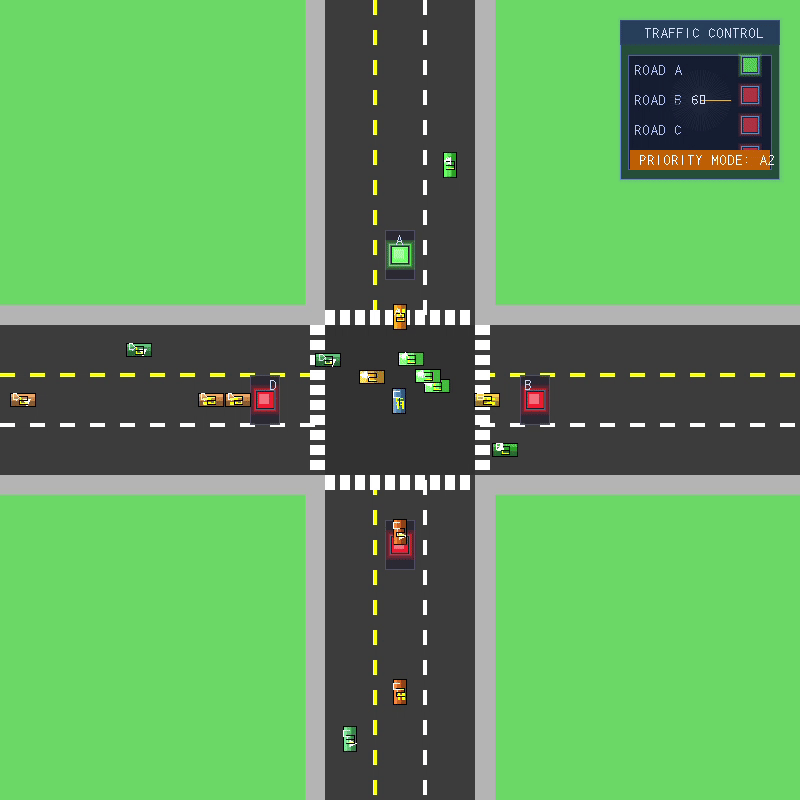

# dsa-queue-simulator
DSA assignment

This is a CPP-based traffic junction simulator using queues and SDL3 for visualization. 
This project is part of a DSA assignment to implement queue-based traffic management.
It simulates traffic movement at a four-way junction, managing vehicles with normal and priority queues.
The traffic generator program creates vehicles, and the simulator processes them based on queue rules.

Features:
1. Real-time traffic simulation
2. Priority lane handling (AL2)
3. Normal/High-priority mode switching
4. Vehicle queue visualization
5. Traffic light state synchronization
6. File-based inter-process communication

Prerequisites:
1. C++17 compatible compiler
2. CMake 3.12+
3. SDL3 library
4. Git

